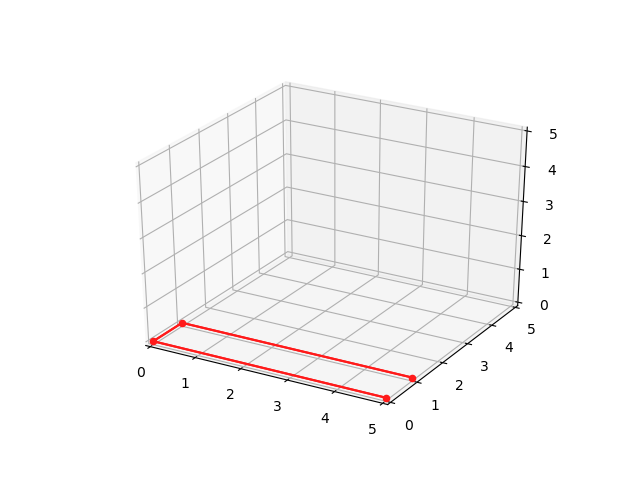
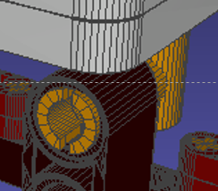
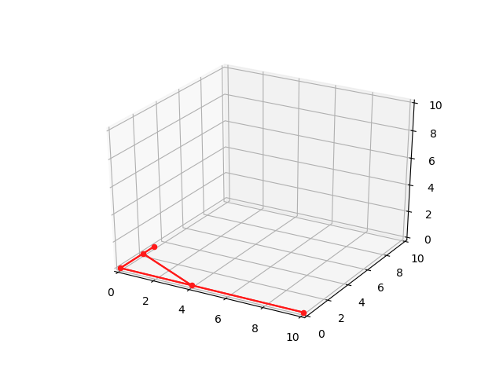
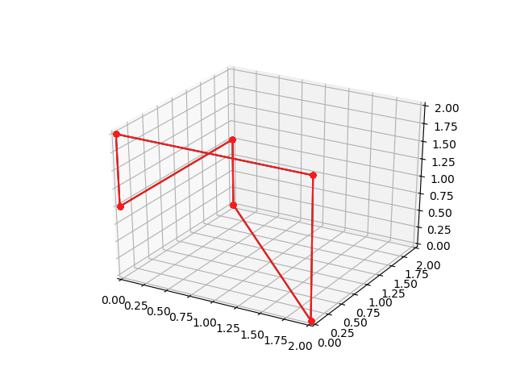

# LEGO_Technic-Basics
This project aims to provide easy and common operations, e.g., transformation, abstraction, viewing, for LEGO Technic bricks.
I'm currently translating my C++ project "Computational LEGO Technic Design (SIGGRAPH Asia 2019)" to python tools.

LEGO Solver
============

Usage
-------

First thing first, clone the repo and init submodules (Eigen3.3.7)
```
git clone --recurse-submodules
// OR if you already cloned without initializing submodules...
git submodule update --init --recursive
```

### Linear Solver - `solver`
```
make cpp/solver
```
`solver` takes the data file as input, generates the matrices along the motion of the object, and write them to a file. To get the motion of a certain shape, find the data file in `data/object` directory, for example `new-triangle.txt`. Then,
```
make new-triangle.png
```
The above invokes the solver and utilizes a python script to visualize the motion using `matplotlib` (so make sure it's installed beforehand). The plot will be saved in the root directory.

Analogously, to run `solver` on some new input data, the most convenient way is, prepare the data file according to the specm say `new-lego.txt` and put it in the `data/object` directory, then run `make new-lego.png`

Dependencies
------------
- `solver`
  - Eigen
- `gurobi_solver`
  - Eigen
  - [Gurobi (9.0)](https://www.gurobi.com/) (not open-source, you might need a proper license from them)
- `constraint_matrix_extractor`
  - Eigen
- `*.py`
  - Python 3.7+
  - numpy, matplotlib, pyqtgraph

Data File Spec
-----------------------
Data files (extension `.txt`) specify the input data to the solver program. They are archived in [`data/object/`](./data/object), e.g, [`data/object/hard-u-10.txt`](./data/object/hard-u-10.txt).

A data file is made up of different sections.
- `P` Points/Vertice (Compulsory)
- `E` Edges (Compulsory)
- `pins` Pins (Optional)
- `anchors` Anchors (Optional)

```
P
number_of_vertices
v0_x v0_y v0_z
v1_x v1_y v1_z
...
E
number_of_edges
vertex_1a_index_into_P vertex_1b_index_into_P
vertex_2a_index_into_P vertex_2b_index_into_P
...
pins                  # Optional 
number_of_pins
vertex_index_of_joint pin_end_edge_index beam_end_edge_index
vertex_index_of_joint pin_end_edge_index beam_end_edge_index
...
anchors               # Optional
number_of_anchors
vertex_index_of_joint pin_end_edge_index beam_end_edge_index
vertex_index_of_joint pin_end_edge_index beam_end_edge_index
...
```

### `P` Points/Vertices

This section starts with a line with a single character `P`. 
The next line contains a single integer *n*, indicating the number of vertices in the data file. Follows *n* lines representing *n* vertices. They form a size-*n* list of the vertices.
Each line contains 3 floating point numbers, indicating the *x*, *y*, *z* coordinates of the point.
Coordinates are seperated by one whitespace, in either normal decimal notation or scientific notation. 

Here comes a example from `data/object/hard-u-5.txt`, the data file contains 4 vertices. Their coordinates are `(0, 0, 0), (0, 1, 0), (5, 0, 0), (5, 1, 0)`. Note that the 4 vertices are in the xy-plane.
```
P
4
0 0 0
0 5 0
5 0 0
5 5 0
...
```

### `E` Edges

This section starts with a line with a single character `E`. 
The next line contains a single integer *n*, indicating the number of edges in the data file. Follows *n* lines representing *n* edges.
Each line represents an edge that connects two vertices, containing a pair of integers, each of which is the index into the list of vertices as defined in (`P`). Index starting from 0. 

Still take `hard-u-5.txt` as an example as is shown below. The file has 3 edges, they join points 0, 1 `(0, 0, 0)` and `(0, 1, 0)`, points 0 `(0, 0, 0)`, 2 `(5, 0, 0)` and points 1 `(0, 1, 0)`, 3 `(5, 0, 0)`, respectively.
```
...
E
3
0 1
0 2
1 3
...
```

With section `P` and `E`, we define the geometry of the model. Hence, using the information, we can draw the shape of the model with some sticks. The shape of `data/hard-u-5.txt` in 3-d space shall look like this. 



It is not hard to find that, the leftmost point is point 0 `(0, 0, 0)`, which is connected to point 1 `(0, 1, 0)` and 2 `(5, 0, 0)`, as per the specification in section `E`.

### `pins` and `anchors`

To limit the relative motion of two edges (beams in LEGO technic), or to represent non-linear LEGO bricks, it is necessary to facilitate `pins` and `anchors` to constrain two edges.

`pins` represent pins connection in LEGO technic, that is the insertion of one pin into another beam, notice that usually a pin will insert into 2 beams, hence 2 items in `pins` arise.

`anchors` represents the "hard" connection of two edges, which means that they are not allowed to have any relative motion. In other words, at the point of connection, the same translation velocity and rotation velocity of two joining edges shall be enforced. This might come in handy if you try to represent a non-linear beam in this data format.

Analogus to section `P` or `E`, these sections start with a line with a title.
Then follows a **strictly-postive** integer *n* indicating the number of `anchor`/`pin`. If there is no pins/anchors needed in the model, simply don't write the corresponding section as the sections are optional.
```
anchors
5
```
or 
```
pins
2
```
In each of the next *n* lines, we use an integer triplet `a b c` to represent the joint. `a` is an index into the list of vertices. The vertex is where the connections happens. `b` and `c` are indices into the list of edges, indicating the two edges connected by the pin/anchor. 

Note that the order of `b` and `c` matters in `pins`. Recall that a `pin` represents the insertion that a LEGO technic pin into a LEGO technic beam. The edge for the  **pin end** end shall be put in the place of `b`, whereas the edge for the beam shall be in place of `c`. Geometrically, beam `c` could only rotate with respect `b` An example is shown below,



Consider the connection point (say of index 5) at which the yellow pin (the horizontal one) insert into the black beam (the vertical one), say of index 1 and 2, respectively. The yellow brick (edge 1) acts as *pin end*. Therefore, the line for the pin in the `pins` section should be written like this instead of the other way around. 
```
5 1 2
```
In `hard-u-5.txt`, anchors are used to fix the two turning points of the U shape, prevents the beams have relative rotation and translation.
```
anchors
2
0 0 1
1 0 2
```

Note that the vertex for a pin/anchor is not necessarily one of the two vertices of the joining edge. In the following example, edge 2 (vertex 3, 4) joins 0 and 1 by two anchors, but no neither vertex 3 or 4 is the vertex of other beams.

```
P
5
0 0 0
0 3 0
10 0 0
0 2 0
4 0 0
E
3
0 1
0 2
3 4
anchors
3
0 0 1
3 0 2
4 1 2
```
And this is how the example looks like



Of course, the data format also works pretty well for 3-d models, check out [`data/new-triangle.txt`](./data/new-triangle.txt) for the following model, where three *z*-horizontal edges are the beams and three vertical edges are LEGO technic pins.



When use sections `pins` and `anchors` in the same file, please put `pins` section ahead of `anchors`. See a complicated cube example [`data/cube-3.txt`](./data/cube-3.txt)